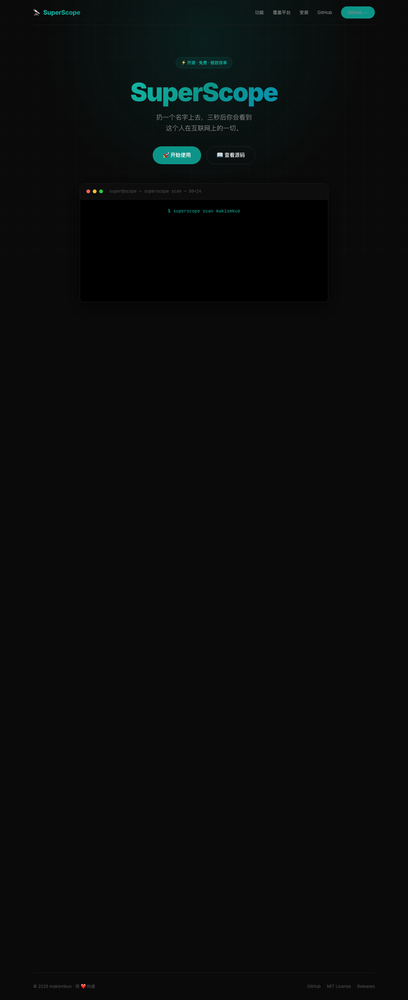

# 🔭 SuperScope

**扔一个名字上去，三秒后你会看到这个人在互联网上的一切。**

<p align="center">
  
</p>

一键扫遍 200+ 国内+国外平台。输入用户名、邮箱、手机号或 Steam ID，系统自动帮你找出所有关联账号。

```bash
pip install superscope
superscope scan 用户名
```

---

## 🚀 一句话告诉别人这是啥

> **全网足迹一键扫描。** 同一个用户名，它帮你查 200+ 平台有没有注册过——GitHub、微博、知乎、小红书、B站、抖音、QQ空间、Instagram、TG……全在。

不需要注册，不需要 API Key，不需要付费。装好就跑。

---

## 🎯 谁会用这个？

| 场景 | 一条命令搞定 |
|------|------------|
| **查自己** — 哪些旧账号还挂着你的信息？ | `superscope scan 你的用户名` |
| **查合作对象** — 他到底是不是真的大佬？ | `superscope scan 对方ID` |
| **查网友** — 群里跟你聊天的是谁？ | `superscope scan 他的昵称` |
| **查邮箱泄露** — 你的邮箱在哪些站注册过？ | `superscope scan email@xx.com --id-type email` |
| **查 Steam 好友** — 他还有哪些社交账号？ | `superscope scan 7656119... --id-type steam_id` |

---

## ⚡ 3 秒上手

```bash
# 搜用户名（最常用）
superscope scan someone

# 搜邮箱（查有没有泄露）
superscope scan you@gmail.com --id-type email

# 搜手机号
superscope scan +8613800138000 --id-type phone

# 搜 Steam ID
superscope scan 76561198429152906 --id-type steam_id

# 启动网页界面（不用记命令）
superscope web
```

---

## 🧠 功能亮点

| SuperScope 可以 | 
|----------------|
| ✅ 微博、知乎、小红书、B站、豆瓣、QQ空间、贴吧... 国内平台全覆盖 |
| ✅ 用户名 + 邮箱 + 手机号 + Steam ID 多类型搜索 |
| ✅ 跨平台账号关联（头像/Bio相似度匹配） |
| ✅ 人物画像分析（基于平台判断用户类型） |
| ✅ 接入 LLM 自动出报告 |
| ✅ 有 Web 界面 |

---

## 🗺 平台覆盖（持续增加中）

| 类别 | 平台 |
|------|------|
| 🌏 国际主流 | GitHub、Twitter/X、Reddit、Instagram、TikTok、Telegram、Steam、Hacker News、Stack Overflow、Medium、Keybase、Pinterest、Twitch、Spotify、LinkedIn、Facebook + 100+ |
| 🇨🇳 国内平台 | QQ空间、微博、知乎、Bilibili、小红书、豆瓣、百度贴吧、CSDN、掘金、V2EX、SegmentFault、网易云音乐 |
| 📧 邮箱查泄露 | Gravatar、HaveIBeenPwned、EmailRep、LeakCheck |
| 📱 手机查询 | TrueCaller |

---

## 🛠 更多玩法

```bash
# 指定输出
superscope scan someone -f html -o report.html
superscope scan someone -f json

# 只看国内平台
superscope scan someone --tags china

# 只看国外
superscope scan someone --country us

# 挂代理
superscope scan someone --proxy socks5://127.0.0.1:1080

# 浏览器引擎（需要 Playwright，扫 JS 站点）
pip install superscope[playwright]
python3 -m playwright install chromium
superscope scan someone --browser --tags china
```

---

## 👥 适合谁？

- **HR / 招聘** — 面试前扫一下，简历水分一秒现形
- **安全从业者** — 社工、红队、渗透测试
- **自媒体 / 博主** — 合作前查对方底细
- **所有人** — 搜自己：看看网上谁在冒充你

---

## 📦 安装

```bash
# 基础版（HTTP 扫描，够用）
pip install superscope

# 一键装全家桶
pip install "superscope[all]"

# 从源码
git clone https://github.com/makismkuo/superscope.git
cd superscope && pip install -e .
```

---

<p align="center">
  <b>MIT License</b> · 开源 · 免费 · 无广告<br>
  <a href="https://github.com/makismkuo/superscope">GitHub → github.com/makismkuo/superscope</a>
</p>
